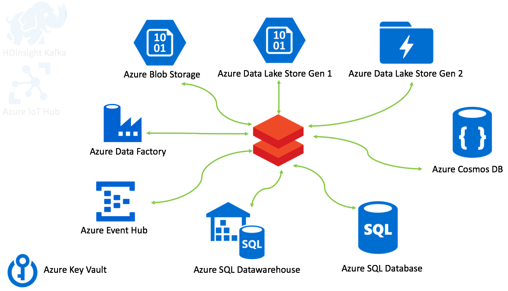
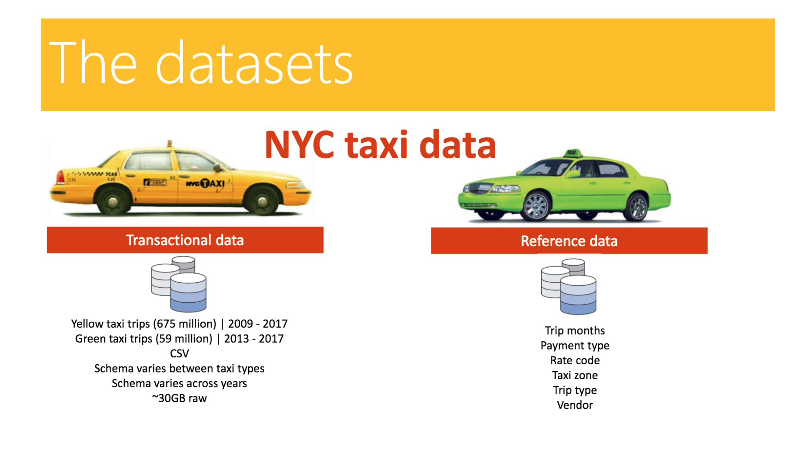
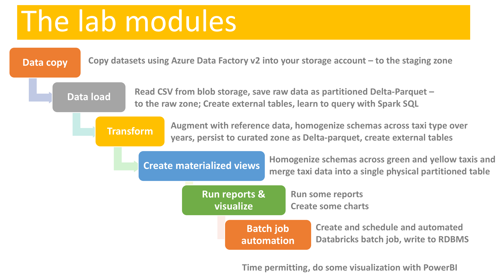

# Azure Databricks NYC Taxi Workshop

This is a multi-part (free) workshop featuring Azure Databricks. It covers basics of working with Azure Data Services from Spark on Databricks with Chicago crimes public dataset, followed by an end-to-end data engineering workshop with the NYC Taxi public dataset, and finally an end-to-end machine learning workshop.  The workshop is offered in Scala and Python.

The goal of this workshop is deliver a clear understanding of how to provision Azure data services, how the data services services integrate with Spark on Azure Databricks, to give you end to end experience with basic data engineering and basic data science on Azure Databricks, and to share some boilerplate code to use in your projects.  

This is a community contribution, so we appreciate feedback and contribution.

## Target Audience

- Architects
- Data Engineers
- Data Scientists

## Pre-Requisite Knowledge

- Prior knowledge of Spark, is beneficial
- Familiarity/experience with Scala/Python

## Azure Pre-Requisites

A subscription with at least $200 credit for a continuous 10-14 hours of usage.

## 1.  Module 1 - Primer

This module covers basics of integrating with Azure Data Services from Spark on Azure Databricks in batch mode and with structured streaming.

At the end of this module, you will know how to provision, configure, and integrate from Spark with:

1. Azure storage - blob storage, ADLS gen1 and ADLS gen2; Includes Databricks Delta as well
1. Azure Event Hub - publish and subscribe in batch and with structured streaming; Includes Databricks Delta
1. HDInsight Kafka - publish and subscribe in batch and with structured streaming; Includes Databricks Delta
1. Azure SQL database - read/write primer in batch and structured streaming
1. Azure SQL datawarehouse - read/write primer in batch and structured streaming
1. Azure Cosmos DB (core API - SQL API/document oriented) - read/write primer in batch and structured streaming; Includes structured streaming aggregation computation
1. Azure Data Factory - automating Spark notebooks in Azure Databricks with Azure Data Factory version 2
1. Azure Key Vault for secrets management

The Chicago crimes dataset is leveraged in the lab.

## 2.  Module 2 - Data Engineering Workshop

This is a *batch focused* module and covers building blocks of standing up a data engineering pipeline.  The [NYC taxi dataset](http://www.nyc.gov/html/tlc/html/about/trip_record_data.shtml) (yellow and green taxi trips) is leveraged in the labs.

## 3. Module 3 - Data Science Workshop

This is a SparkML and Azure Machine Learning services

The following is a summary of content covered:

1. Perform feature engineering and feature selection activities
1. Create an [Azure Machine Learning (AML) service workspace](https://azure.microsoft.com/en-us/services/machine-learning-service/)
1. Connect to an AML workspace
1. Create PySpark models and leverage AML Experiment tracking
1. Leverage Automated ML capabilities in AML
1. Deploy the best performing model as a REST API in a Docker continer

## Next

- [Provisioning Guide](docs/1-provisioning-guide/ProvisioningGuide.md)
- [Lab Data Copy Guide](docs/3-data-copy-guide/README.md)
- [Lab Guide](docs/2-lab-guide/README.md)

## Credits
- Anagha Khanolkar (Chicago) - creator of workshop, primary author of workshop, content design, all development in Scala, primer module in Pyspark
- Ryan Murphy (St Louis) - contribution to the data engineering workshop transformation rules, schema and more
- Rajdeep Biswas (Houston) - writing the entire PySpark version of the data engineering lab
- Steve Howard (St Louis) - contributing to the PySpark version of the data engineering lab
- Erik Zwiefel (Minneapolis) - content design of data science lab, PySpark version, Azure Machine Learning service integration for operationalization as a REST service, AutoML
- Thomas Abraham (St Louis) - development of ADFv2 integration primer in Pyspark
- Matt Stenzel, Christopher House (Minneapolis) - testing
