# Provisioning Guide for Azure HDInsight Kafka

This section covers provisioning of Azure HDInsight Kafka and configuration required.

From the portal navigate to the resource group you created.

## Provision HDInsight Kafka 
Follow the instructions below to provision Kafka.

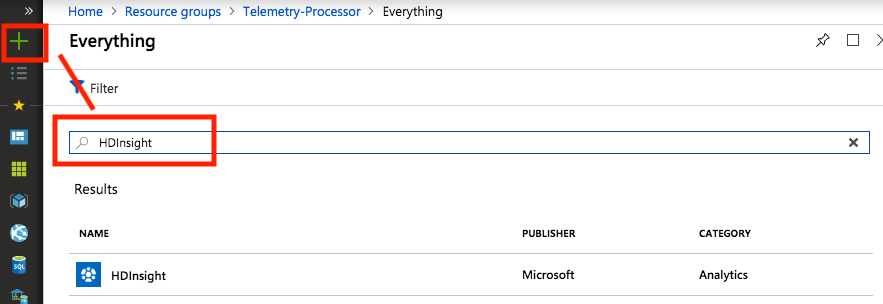


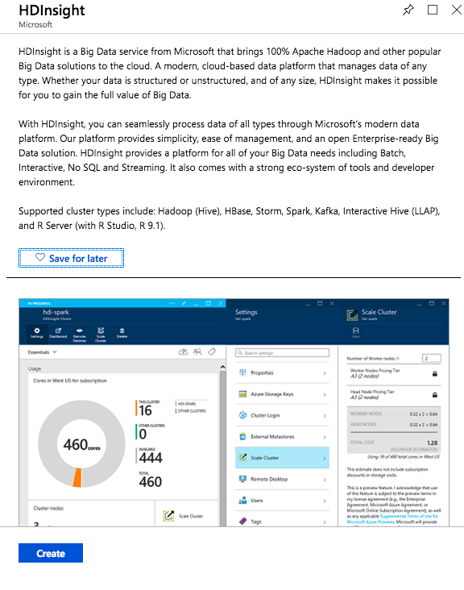


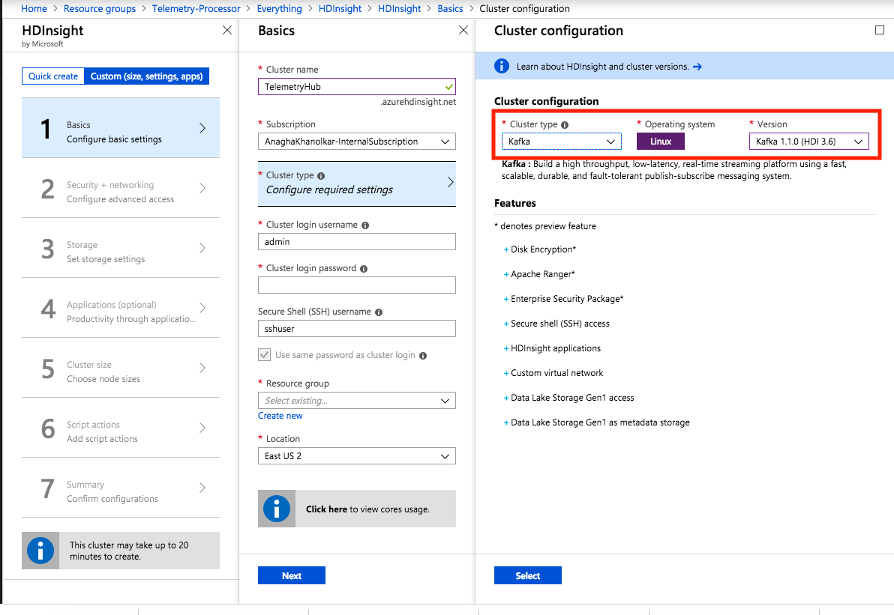


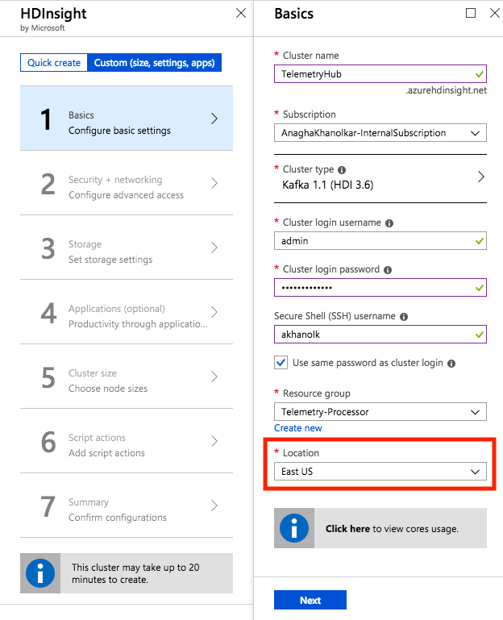


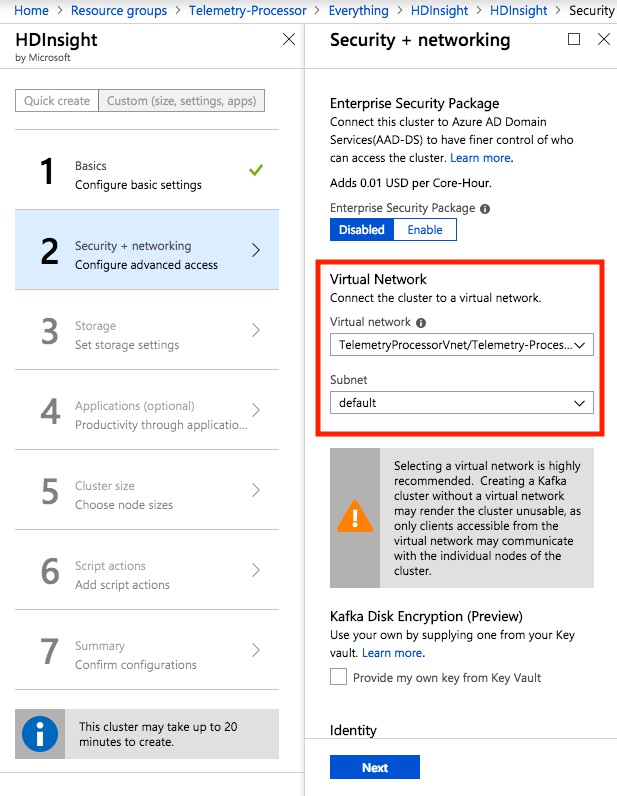


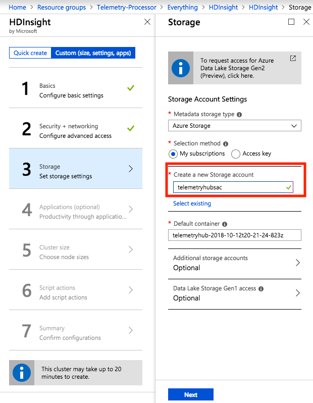


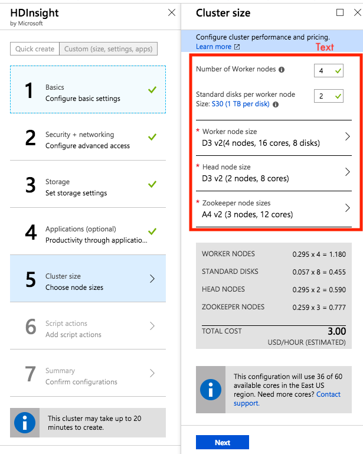


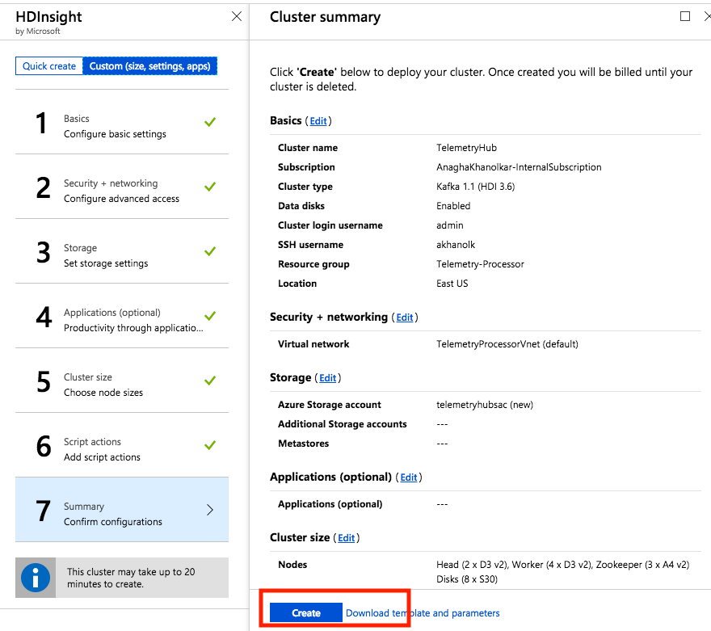


## Configure Kafka for IP advertising
By default, Zookeeper returns the FQDN of the Kafka brokers to clients - not resolvable by entities outside the cluster.  Follow the steps below to configure IP advertising/to broadcast IP addresses - from Ambari.

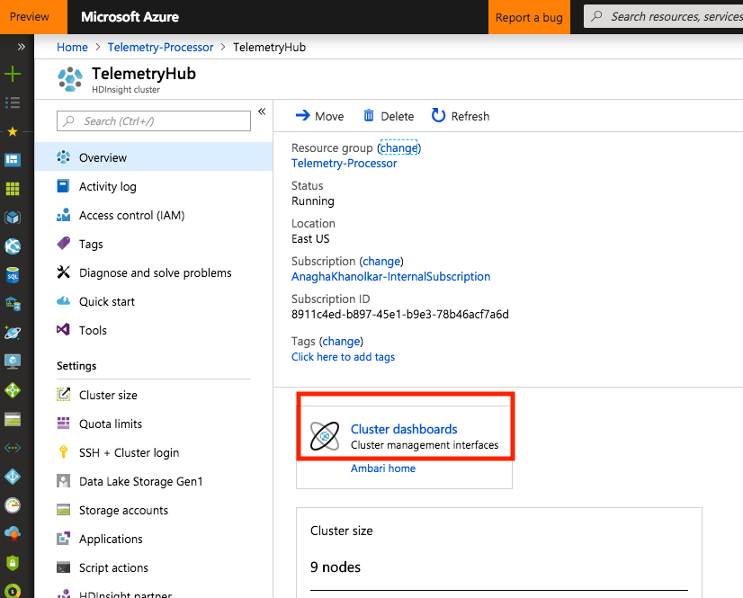

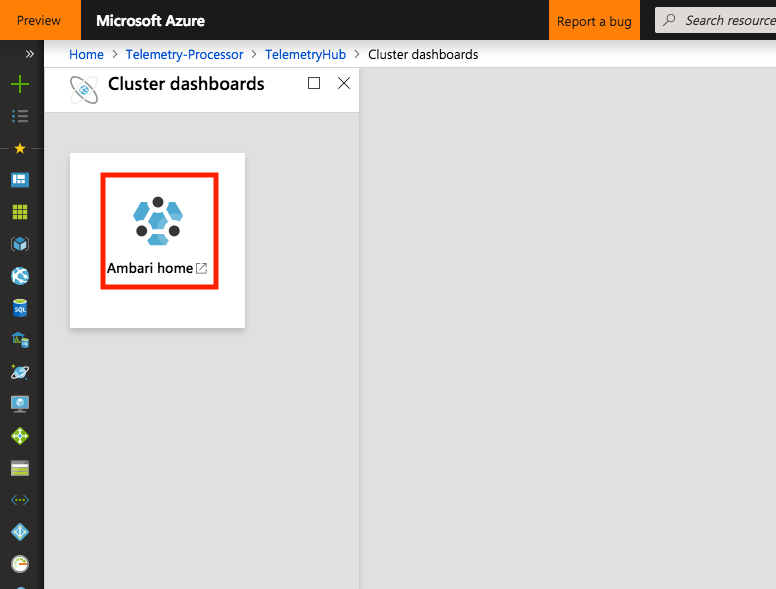

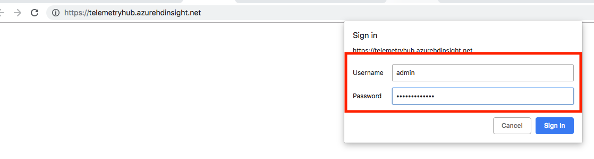

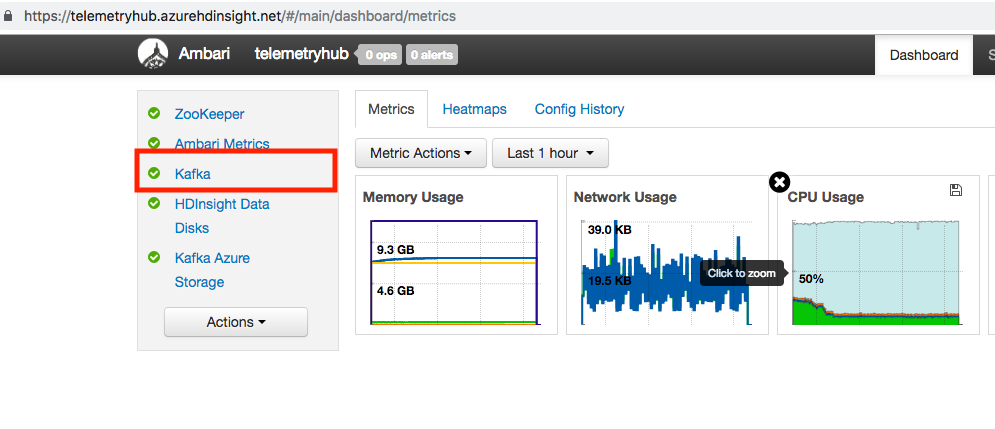

Paste this at the bottom of the kafka-env comfiguration
```sh
# Configure Kafka to advertise IP addresses instead of FQDN
IP_ADDRESS=$(hostname -i)
echo advertised.listeners=$IP_ADDRESS
sed -i.bak -e '/advertised/{/advertised@/!d;}' /usr/hdp/current/kafka-broker/conf/server.properties
echo "advertised.listeners=PLAINTEXT://$IP_ADDRESS:9092" >> /usr/hdp/current/kafka-broker/conf/server.properties
```
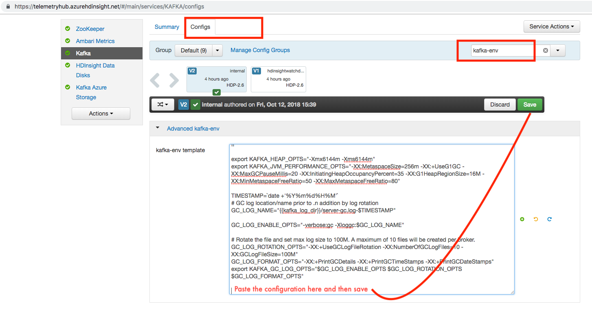


## Configure Kafka to listen on all network interfaces
By default, Zookeeper returns the domain name of the Kafka brokers to clients - not resolvable by entities outside the cluster.  Follow the steps below to configure IP advertising.
```PLAINTEXT://0.0.0.0:9092```
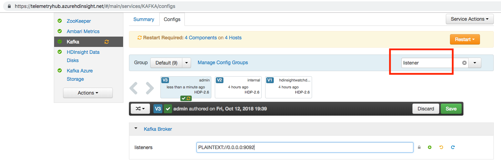


## Restart the Kafka service from Ambari
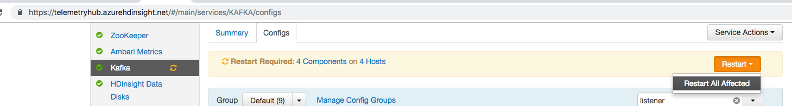

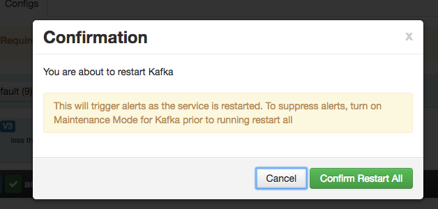

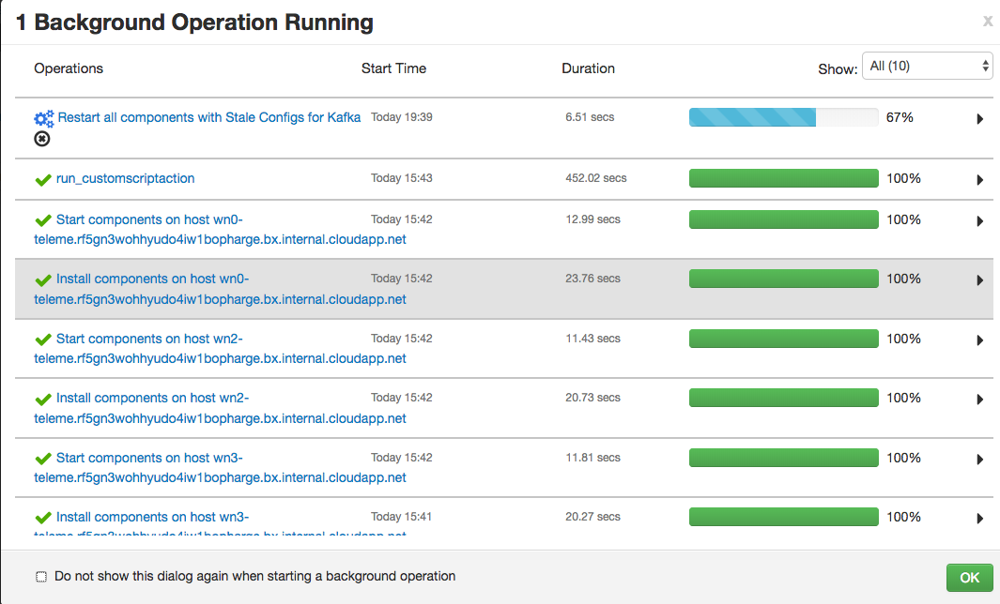


## Capture the IP addresses of the brokers
The brokers have names starting with wn*.  Capture their private IP addresses.
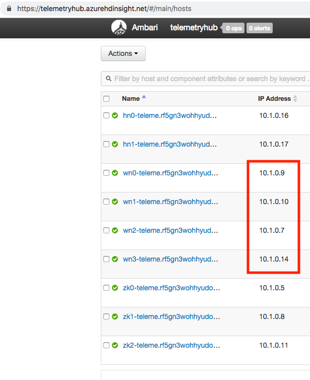


In the author's case, the broker port list is:
10.1.0.7:9092,10.1.0.9:9092,10.1.0.10:9092,10.1.0.14:9092