# 05. Azure Cosmos DB - Lab instructions

In this lab module - we will learn to integrate with Azure Cosmos DB from Spark - batch and with Spark Structured Streaming.  
- **Batch:** 
In the batch lab - the source is the curated crimes dataset in DBFS, and the target is Azure Cosmos DB. 

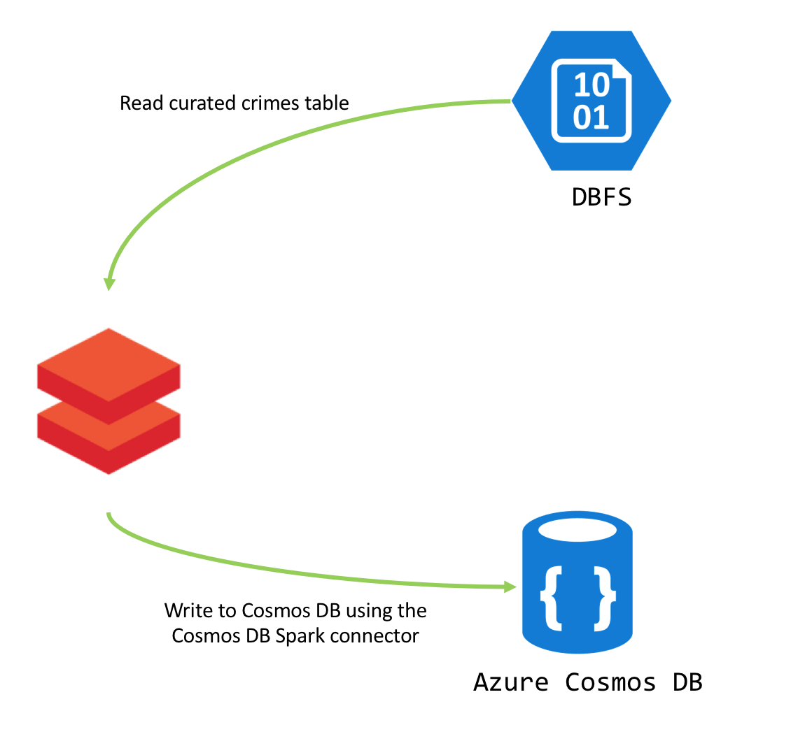

- **Streaming:** 
(1) In the structured streaming lab, the source is Azure Event Hub, and the sink is Azure Cosmos DB. 
We will leverage the core API - also referred to as SQL API/document API - the native document-oriented API of Azure Cosmos DB. 
(2) We will also learn to do streaming aggregations 

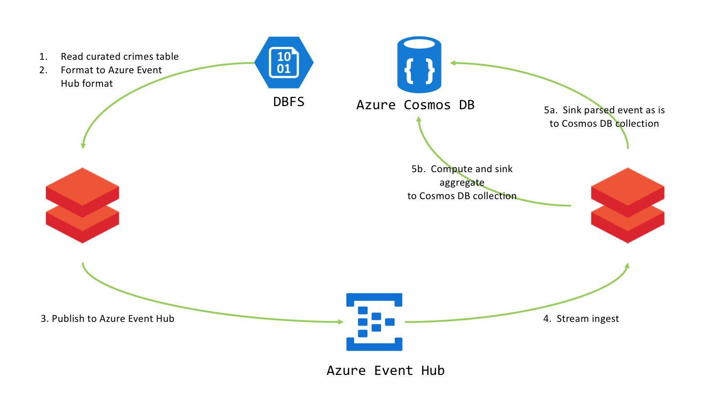

## A) Provisioning and configuring

### A1. Capture URI and credentials
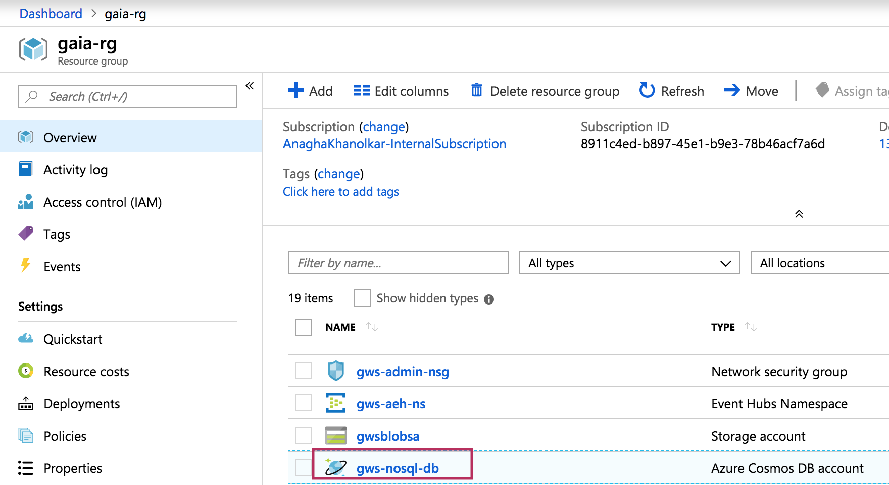
 

 

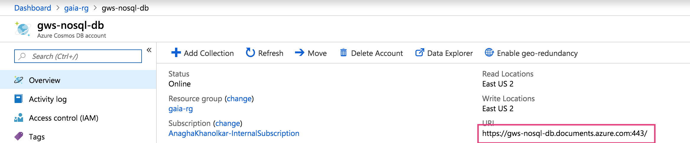
 

 

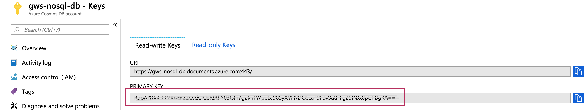
 

 

### A2. Create database and collection in the account
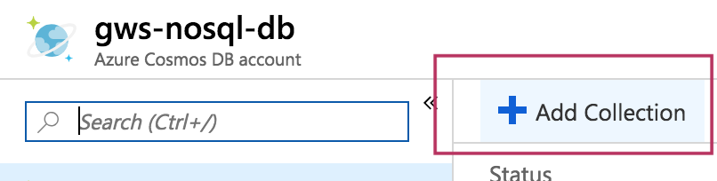
 

 

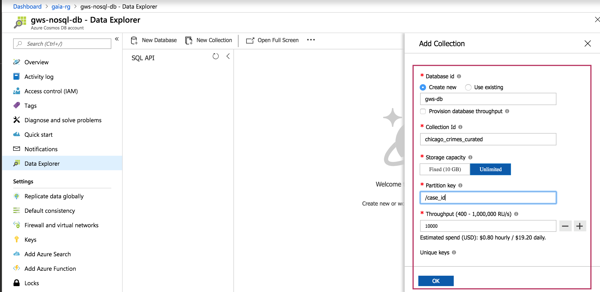
 

 

### A3. Attach the Azure Cosmos DB Spark connector uber jar to the cluster
Go to https://search.maven.org/search?q=a:azure-cosmosdb-spark_2.3.0_2.11 or the link to the latest version of the jar as detailed [here](https://docs.azuredatabricks.net/spark/latest/data-sources/azure/cosmosdb-connector.html).  Download the "uber" jar. 

Steps for attaching to the cluster: 

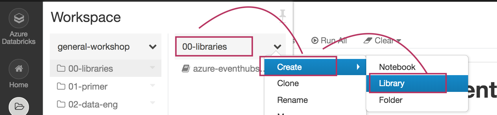
 

 

Click on "Keys" in the left navigation panel.
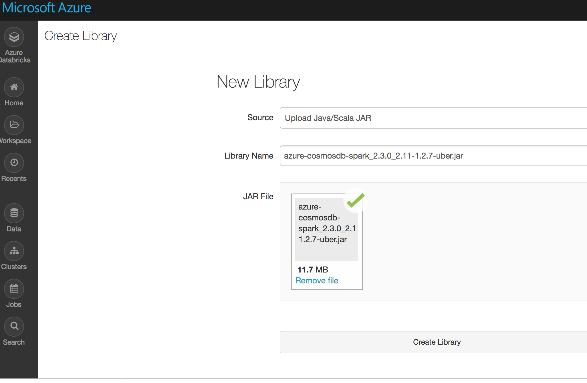
 

 

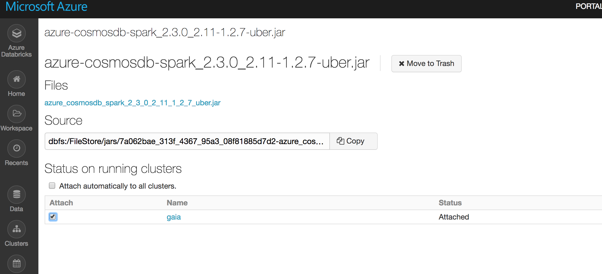
 

 

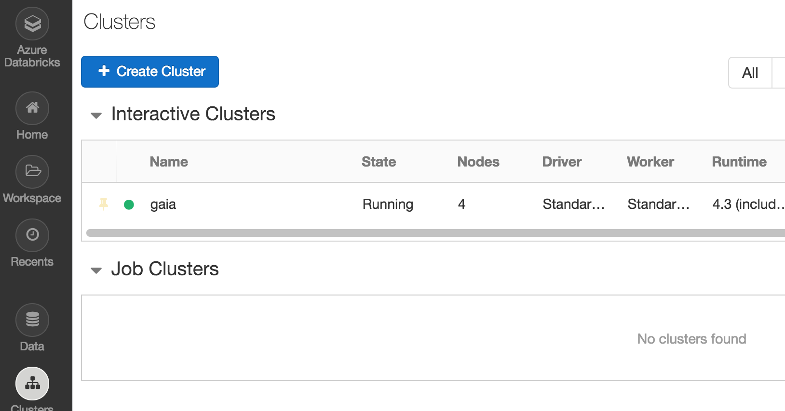
 

 

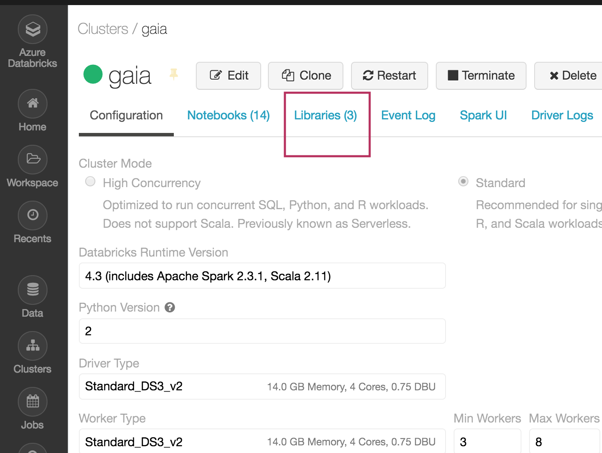
 

 

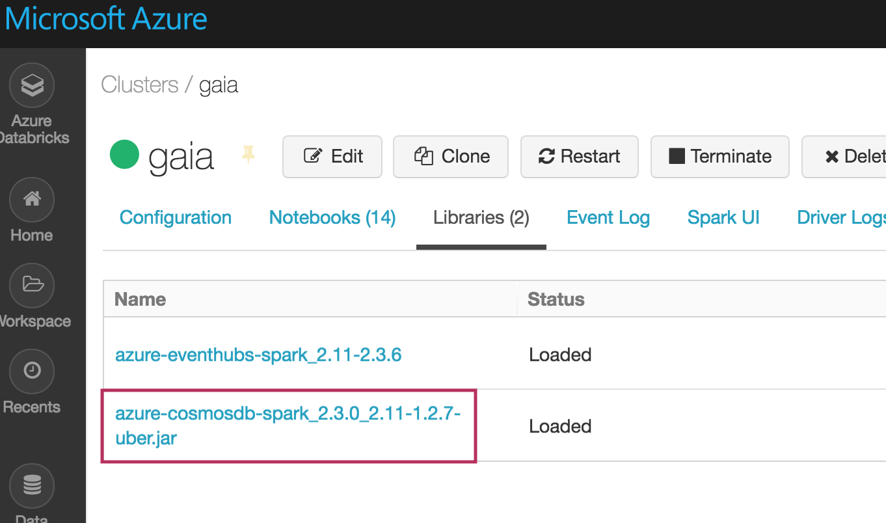
 

 

## B) Lab

### Unit 1. Secure credentials
Refer the notebook for instructions.

### Unit 2. Read/write in batch mode 
In this unit, we will read curated crimes data in a DBFS backed external table, and learn to write to Azure Cosmos DB. 
We will learn to read from Azure Cosmos DB.

### Unit 3. Publish to Azure Event Hub
We will re-run the event publisher from the event hub module.

### Unit 4. Consume from Azure Event Hub, sink to Azure Cosmos DB, event event
We will create a new collection to store streaming crimes called chicago_crimes_curated_stream in the existing database, with 1,000 RUs, partition key of "/case_id".  Once provisioned, we will scale to 10,000 RUs.  We will leverage structured streaming to read stream from Azure Event Hub, and sink to Azure Cosmos DB.

### Unit 5. Consume from Azure Event Hub, sink to Azure Cosmos DB, event aggregates
We will create a new collection to store streaming aggregates called chicago_crimes_curated_stream_aggr in the existing database, with 1,000 RUs, partition key of "/case_type".  Once provisioned, we will scale to 10,000 RUs.  We will leverage structured streaming to read stream from Azure Event Hub, and sink to Azure Cosmos DB, this time - we will tweak the code from unit 5, to capture count by case type, and also ensure for a case type there is exactly one record in Cosmos DB with incremental updates to counts from the streaming process.

