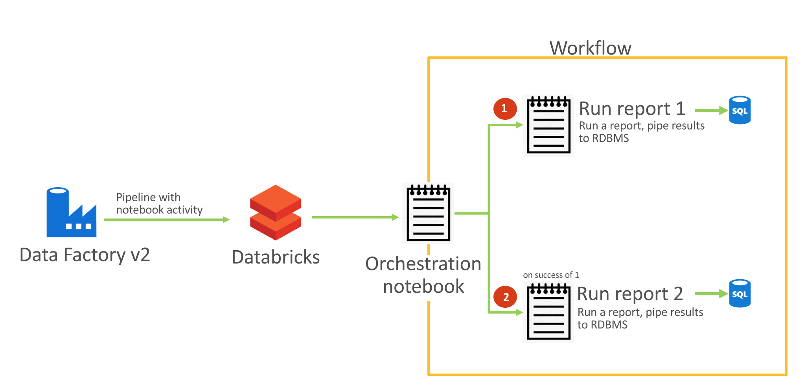
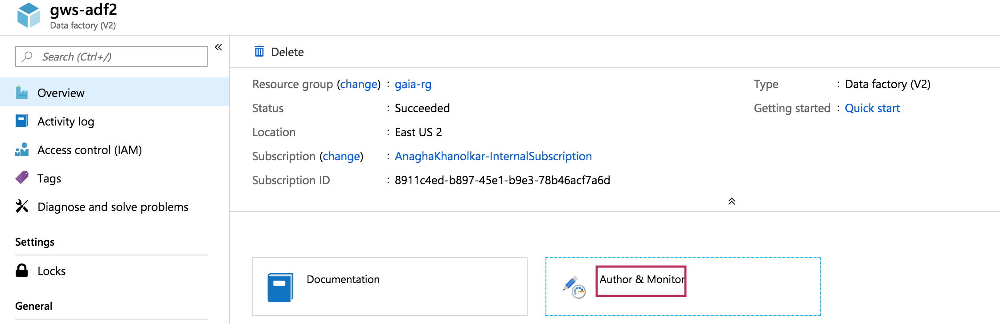
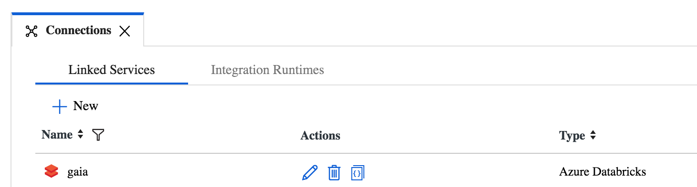
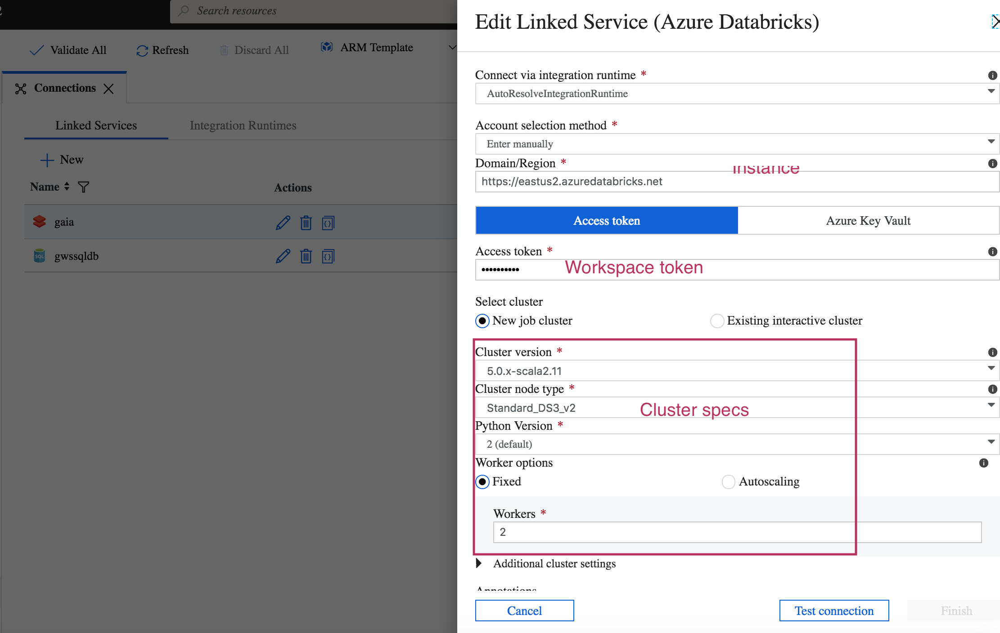
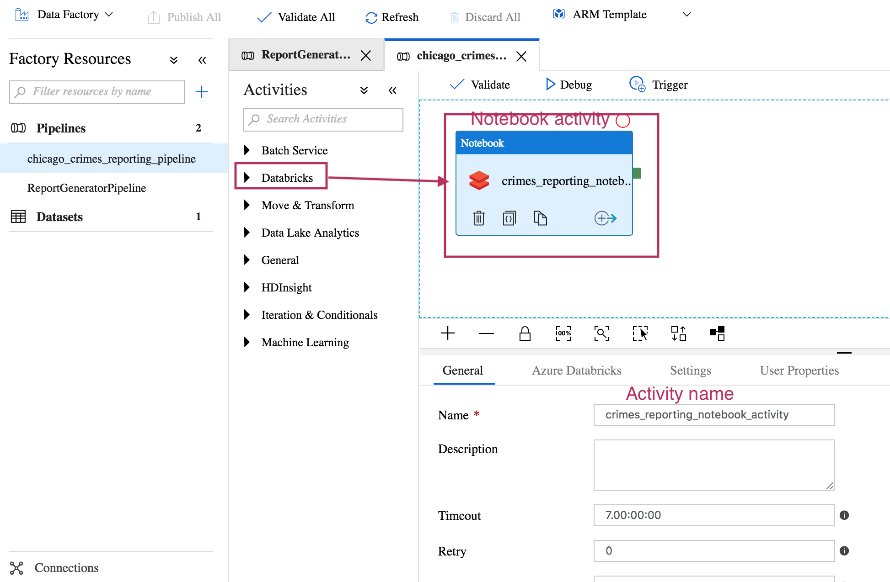
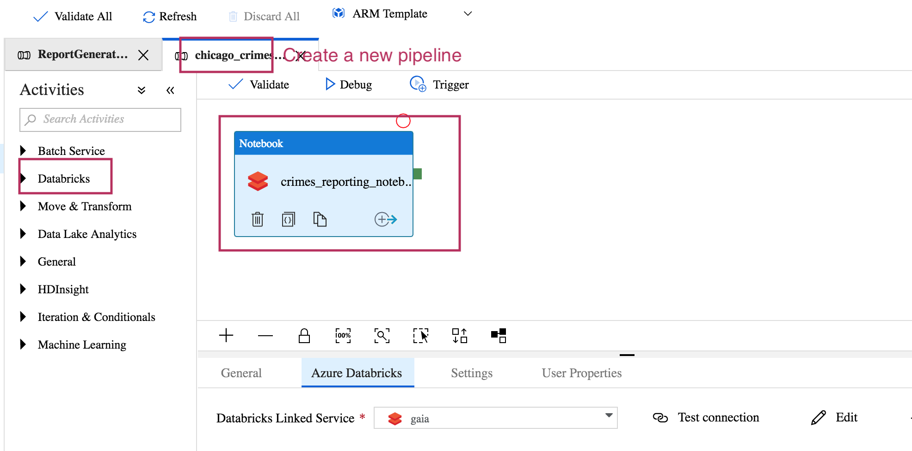
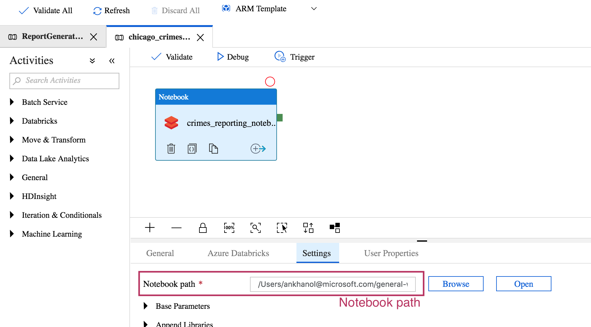
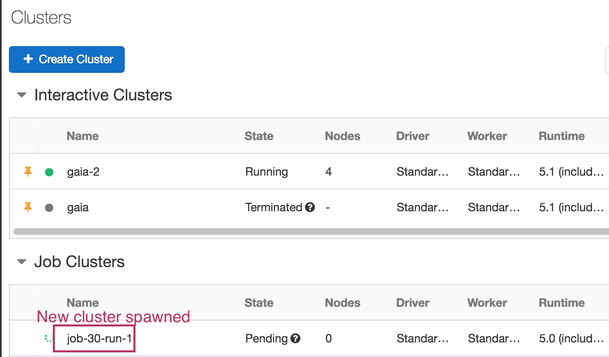
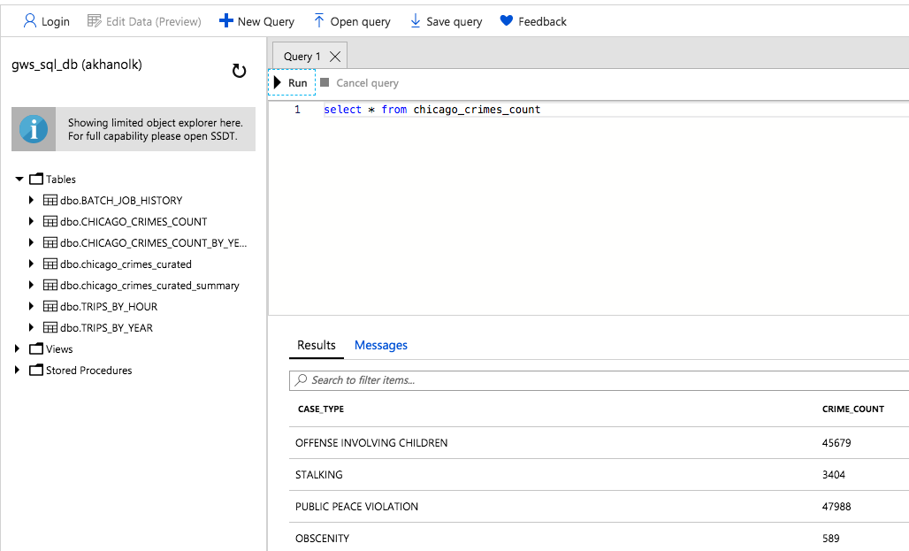
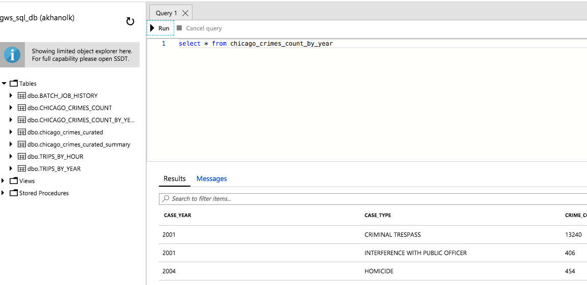

# 06. Azure Data Factory v2 - Lab instructions

In this lab module - we will learn to automate Databricks Spark applications with Azure Data Factory v2.  We will create a simple Data Factory v2 pipeline that runs a notebook activity. This Azure Data Factory v2 notebook activity, will spawn a new cluster in a pre-configured existing Databricks workspace, and invoke a pre-existing tested notebook workflow (calls two notebooks) defined in the Databricks workspace.We will learn to schedule the pipeline to run on a time basis, as well as run on-demand.  Finally, we will learn to monitor in Azure Data Factory v2.<br>

The following is a pictorial overview.<br>


<br>
<hr>

## A) Dependencies
1.  Provision data factory
2.  Completion of primer lab for Azure Storage
3.  Completion of primer lab for Azure SQL Database
4.  Adequate cores to provision Azure databricks cluster
5.  Notebooks in the module, loaded into your workspace
6.  Database objects - tables created ahead of time

## B) Database objects to be created in Azure SQL Database

1.  Create table: batch_job_history
```
DROP TABLE IF EXISTS dbo.BATCH_JOB_HISTORY; 
CREATE TABLE BATCH_JOB_HISTORY( 
batch_id int, 
batch_step_id int, 
batch_step_description varchar(100), 
batch_step_status varchar(30), 
batch_step_time varchar(30) );
```

2.  Create table: chicago_crimes_count
```
DROP TABLE IF EXISTS dbo.CHICAGO_CRIMES_COUNT; 
CREATE TABLE CHICAGO_CRIMES_COUNT( 
case_type varchar(100), 
crime_count bigint);
```

3.  Create table: chicago_crimes_count_by_year
```
DROP TABLE IF EXISTS dbo.CHICAGO_CRIMES_COUNT_BY_YEAR; 
CREATE TABLE CHICAGO_CRIMES_COUNT_YEAR( 
case_year int,
case_type varchar(100), 
crime_count bigint);
```
## C) Databricks notebooks review

### 1.  Notebook workflow:
1.  Generates a batch ID
2.  Inserts into the ETL metadata table, BATCH_JOB_HISTORY, that the report 1 generation has started
3.  Runs report 1 notebook
4.  If report 1 completed successfully, inserts into the ETL metadata table, BATCH_JOB_HISTORY, that the report 1 generation has completed
5.  Inserts into the ETL metadata table, BATCH_JOB_HISTORY, that the report 2 generation has started
3.  Runs report 2 notebook
4.  If report 2 completed successfully, inserts into the ETL metadata table, BATCH_JOB_HISTORY, that the report 2 generation has completed

### 2. Report 1:
1.  Generates a report of count by crime type and pipes it to the pre-existing chicago_crimes_count RDBMS table in overwrite mode
2.  Exits with status of "pass" if completed successfully

### 3. Report 2:
1.  Generates a report of count by crime type, by year, and pipes it to the pre-existing chicago_crimes_count RDBMS table in overwrite mode
2.  Exits with status of "pass" if completed successfully


## D) ADFv2 scheduling/orchestration

We will create an ADFv2 pipeline with a notebook activity in this final section.<br>

### 1.  Create a Databricks token for use in ADFv2<br>
In the UI - go to workspace->settings->access tokens and create a token.  Capture and note down safely.<br><br>


<br>
<hr>

### 2.  Create a linked service for Databricks compute from the Data Factory UI<br>
- This has a dependency on (1) Databricks workspace - should exist already, and (2) also the Databricks token<br>
- Select your subscription<br>
- Enter your access token<br>
- Select DBR 5.1<br>
- Select DS3v2 - 3 workers, fixed<br><br>


<br>
<hr>


<br>
<hr>

### 3.  Create a pipeline<br>
- Add a Databricks notebook activity<br>
- In the notebook activity, in the general tab, name the workflow<br>
- In the Azure Databricks tab, select the linked service and test connection<br>
- In the settings path, navigate and pick the notebook - general-workshop/scala/01-primer/06-azure-data-factory-v2/workflow<br>
- Validate the pipeline<br>
- Debug the pipeline<br>
- Publish the pipeline<br><br>


<br>
<hr>


<br>
<hr>


<br>
<hr>


<br>
<hr>

**Post execution:**


<br>
<hr>


<br>
<hr>

### 4.  Trigger the pipeline<br>
- Run the pipeline now<br>
Refer documentation to familiarize yourself with scheduling a pipeline<br><br>

### 5.  Monitor the pipeline<br><br>

### 6.  Lets review the execution of the workflow in Databricks<br><br>

### 7.  Discussion:
Passing parameters to your cluster (base parameters in notebook activity settings) and between notebooks (notebook widgets)

